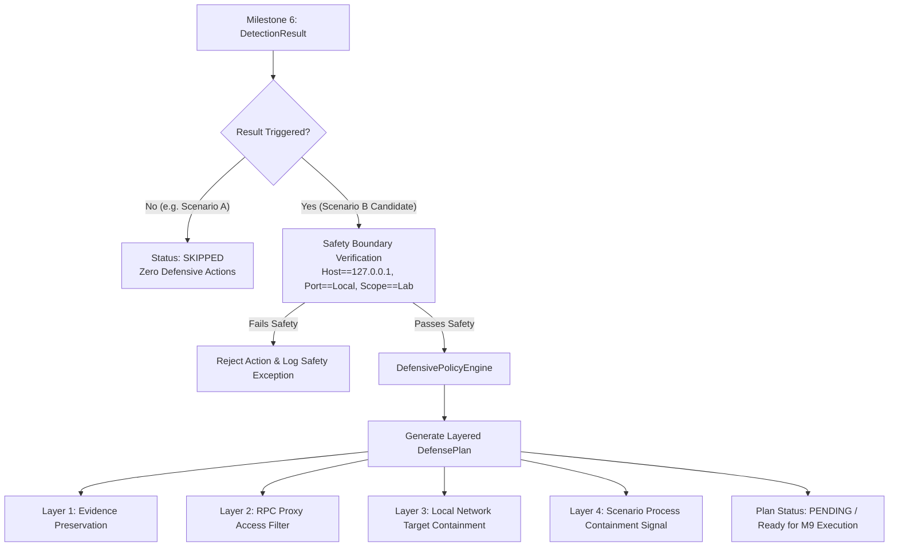

# ChainC2 Sentinel — Defensive Response Design Specification (Milestone 8)

## 1. Research Purpose & Question

### Research Context
Phase 1 established that synthetic blockchain-mediated C2-like behavior can be correlated and detected in a controlled laboratory environment with 100% recall, 0.0% false positives, and ~0.048ms processing latency (Milestones 1–7).

Phase 2 investigates the defensive response to that detected laboratory behavior, addressing the core research question:
> *"Once blockchain-mediated C2-like behavior is detected, what controlled defensive measures can be applied to reduce or contain the observed behavior?"*

### Safety Boundaries & Research Integrity
- **Laboratory Scope Only:** All defensive actions are confined entirely to the project's controlled laboratory components (the JSON-RPC proxy, the local HTTP target server, and cooperative laboratory scenario workers).
- **No System-Wide Changes:** Zero modification of the host OS firewall (e.g. Windows Defender Firewall, iptables), kernel tables, or arbitrary OS processes.
- **No Public Blockchain Interaction:** Operates solely against the local Hardhat testbed (Chain ID 31337).
- **Realistic Research Claims:** We do **NOT** claim that blocking a smart contract address or local RPC endpoint neutralizes real-world C2 or stops an adversary on public blockchains. We demonstrate that within our monitored perimeter, automated defensive actions can demonstrably sever or contain the observed behavioral sequence.

---

## 2. Response Decision Flow

### Response Triggering Invariants
1. **Factual Causality:** A defensive plan can **ONLY** be formulated if `DetectionResult.status == DetectionStatus.TRIGGERED` and `triggered is True`. Non-triggered detections (such as Scenario A legitimate Web3 activity) yield a `DefensePlanStatus.SKIPPED` plan with 0 actions.
2. **Evidence Preservation Priority:** Evidence snapshotting occurs first to prevent destruction or loss of volatile telemetry.
3. **Defense-in-Depth:** Mitigations address both the blockchain ingestion vector (RPC proxy) and the subsequent egress channel (local beacon target).

---

## 3. Supported Controlled Mitigation Mechanisms

| Layer | Mechanism | Implementation Component | Safety & Containment Justification | Reversible? |
|:---|:---|:---|:---|:---:|
| **Evidence** | Immutable Snapshot | `BaseEvidencePreserver` / Event Archive | Freezes telemetry, correlated timeline, and detection condition breakdown to disk. | No (Audit Trail) |
| **RPC** | Contract Query Filter | `aiohttp` JSON-RPC Proxy (`src/rpc_proxy/`) | Drops or rejects `eth_call` / `eth_sendRawTransaction` targeting `C2DataStore` address with error code `-32000 Filtered`. Requires no OS firewall changes. | Yes |
| **Network** | Beacon Target Containment | `LocalHttpTargetServer` (`src/http_target/`) | Returns `HTTP 403 Forbidden` for subsequent `/beacon` requests matching the quarantined client/run ID, containing synthetic data egress. | Yes |
| **Process** | Controlled Isolation Signal | Scenario Worker Registry | Cooperatively halts or isolates the specific laboratory scenario process without calling dangerous OS-level `kill -9` on arbitrary PIDs. | Yes |

---

## 4. Response Interfaces & Data Models

The defensive response architecture is implemented in the dedicated `src/protection/` package:

### Data Models (`src/protection/models.py`)
- **`MitigationType` (Enum):** `EVIDENCE_PRESERVATION`, `RPC_FILTER`, `NETWORK_CONTAINMENT`, `PROCESS_ISOLATION`.
- **`MitigationStatus` (Enum):** `REQUESTED`, `EXECUTED`, `VERIFIED`, `FAILED`, `ROLLED_BACK`.
- **`DefensePlanStatus` (Enum):** `PENDING`, `EXECUTED`, `VERIFIED`, `FAILED`, `SKIPPED`, `ROLLED_BACK`.
- **`MitigationAction`:** Individual, atomic mitigation request with target layer, resource, parameter payload, verification strategy, and execution/verification timestamps.
- **`DefensePlan`:** Structured container binding the detection candidate ID, rule ID, and ordered mitigation actions.
- **`DefenseExecutionRecord`:** Complete audit log capturing execution duration, action counts, verification outcomes, and rollback availability.

### Abstract Responders (`src/protection/interfaces.py`)
- **`BaseMitigationHandler`:** Standard contract defining:
  - `execute(action: MitigationAction) -> bool`
  - `verify(action: MitigationAction) -> bool`
  - `rollback(action: MitigationAction) -> bool`
- **`BaseEvidencePreserver`:** Contract defining:
  - `preserve_evidence(detection_result, sequence) -> str`

### Policy Engine (`src/protection/policy.py`)
- **`DefensivePolicyEngine`:** Evaluates factual detection candidate evidence against safety boundaries and formulates the multi-layer `DefensePlan`.

---

## 5. Verification Strategy & Audit Telemetry

### Verification Strategy
Defensive actions must never be assumed to have succeeded; every action specifies an independent verification test:
1. **RPC Filter Verification:** An active probe sends a JSON-RPC request to the proxy querying the quarantined contract address. Verification passes if the proxy rejects the request with the configured filter response.
2. **Network Containment Verification:** An active probe sends an HTTP POST request to the local `/beacon` endpoint. Verification passes if the target server responds with `HTTP 403 Forbidden`.
3. **Process Isolation Verification:** The laboratory scenario worker registry is inspected to verify that the target scenario process state transitioned to `ISOLATED`.

### Audit Telemetry Requirements
Every mitigation action produces a structured audit record containing:
- `action_id` and parent `plan_id`
- Exact timestamps (`requested_at`, `executed_at`, `verified_at`)
- Observable telemetry deltas (probe responses, HTTP status codes, error messages)
- Rollback state

---

## 6. Failure Handling & Rollback Strategy

1. **Execution Failure:** If any individual handler returns `False` during execution, the plan status transitions to `FAILED`. Diagnostics are recorded in `MitigationAction.error_message`.
2. **Verification Failure:** If an action executes but its independent verification probe fails, the action status is marked `FAILED` with details recorded in `verification_details`.
3. **Rollback Routine:** All reversible actions implement `rollback()`. When invoked (either during failure recovery or post-test environment cleanup), handlers revert proxy filters, unblock beacon endpoints, and restore the baseline state.

---

## 7. Planned Milestone 9 Implementation (Controlled Protection / Mitigation)

Milestone 9 will implement the concrete mitigation handlers fulfilling the Milestone 8 interfaces:
1. **`RpcFilterHandler`:** Attaches to `src/rpc_proxy/proxy.py` to filter contract queries in real time.
2. **`NetworkContainmentHandler`:** Attaches to `src/http_target/server.py` to enforce HTTP 403 containment.
3. **`ProcessIsolationHandler`:** Attaches to the scenario runner to signal laboratory workers.
4. **`EvidenceSnapshotHandler`:** Writes immutable evidence bundles to `data/evidence/`.
5. **`DefenseExecutor`:** Orchestrator executing the ordered `DefensePlan`, running verification probes, and logging structured audit telemetry.

---

## 8. Planned Milestone 10 Measurements (Protection Evaluation)

Milestone 10 will evaluate the mitigation effectiveness under controlled laboratory experiments using deterministic, empirical metrics:

1. **Mitigation Success Rate:**
   $$\text{MSR} = \frac{\text{Successfully Verified Mitigations}}{\text{Total Requested Mitigations}}$$
2. **Containment Latency ($\Delta t_{\text{contain}}$):**
   Elapsed duration from detection candidate output to active containment verification (in milliseconds).
3. **Post-Mitigation Egress Block Rate:**
   Percentage of subsequent beacon attempts blocked by containment rules (target: 100%).
4. **Post-Mitigation Ingress Block Rate:**
   Percentage of subsequent RPC queries blocked by proxy filters (target: 100%).
5. **Legitimate Traffic Preservation (False Mitigation Rate):**
   Verification that Scenario A (legitimate Web3 activity) is completely unimpacted by active filters.
